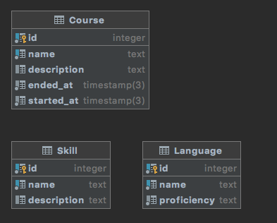

###Визуальное представление схемы данных в виде ERD

### Сущности
1) Course:
- id — уникальный идентификатор (числовой автоинкремент),
- description — описание курса (строка, может быть пустой),
- started_at - дата, когда был начат курс (дата),
- ended_at - дата, когда был закончен курс (дата).
2) Skill:
- id — уникальный идентификатор (числовой автоинкремент),
- name - название навыка (строка),
- description —  описание навыка, уровень им владение (строка, может быть пустой).
3) Language:
- id — уникальный идентификатор (числовой автоинкремент),
- name — название языка (строка),
- proficiency - уровень владения языком.